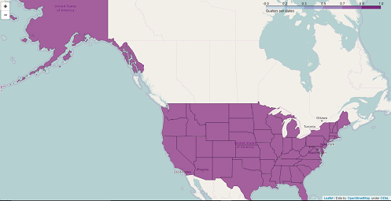

# "coinCollectorProject5_valle"
* This app uses beautifulSoup4 for scrapping a table of quarter coins from
	https://en.wikipedia.org/wiki/50_State_Quarters
*	This information is then saved to a csv file which then is sent to the db.
*	Django is used to load the data to be displayed as a table on a local host IP address (127.0.0.1:).

## 	!Create a folder with anyName and inside that folder clone or fork the following,
*  ---> https://github.com/BorisVV/coinCollectorProject5_valle
* The following files need to be created outside the :file_folder: coinCollectorApp/ (inside your anyName folder)
*	 	$ pip freeze > requirements.txt
		  (followed by:)
*		$ pip install -r requirements.txt
* create a virtualenv in your machine
*	 	$ virtualenv nameOFEnviromentHere
			(example --> $ virtualenv venv)
* Create a **.gitignore** file and include the name of the virtualenv (venv) in it,
	and any other file that you don't want in github.com

## Create TWO FOLDERS inside the :file_folder: coinCollectorAPP/ :file_folder: name: files and :file_folder: name: maps
*	https://raw.githubusercontent.com/minneapolis-edu/mammoths/master/us_states_abbr.json
*	https://raw.githubusercontent.com/minneapolis-edu/mammoths/master/us_states.json
*	Inside the files folder create **two files** with the names: **us_states_abbr.json** and
	  **us_states.json** and save the data.
	  Go to the above links and get the data for us_states_abbr and us_states
	  Copy all (control/command + a)(control/command + c) and paste (contro/command + v) the data inside the **us_states_abbr.json** and **us_states.json**

## $ PIP INSTALL
* 	django
* 	requests
* 	beautifulsoup4
* 	Jinja2
* 	psycopg2
* 	folium
* 	pandas
* !Pillow is not required for this app but can be install with pip if needed.

## Command lines used to RUN the APP (first time, follow the instructions below).
## First
* from the :file_folder: coinCollectorApp/ run the following commands.
*		$ python coinSite/manage.py makemigrations
		  	(no spaces in makemigrations)
	 	$ python coinSite/manage.py migrate
* If you run into trouble, you might need to create a super user first.
* To create a superuser, NOTE - no spaces in createsuperuser,
* from the :file_folder: coinCollectorApp/
*	 	$ python coinSite/manage.py createsuperuser
		  	Enter username (or leave default)
		  	Email (optional)
		  	Enter password
		  	Re-enter password
* (write down the above info as you will need it for Django admin access)
## Second
* from the :file_folder: coinCollectorApp/ run the following commands.
* 		$ python run_app_manager.py  --> to load the data to db.sqlite3
			(-- You only need to run the above line of code once, or if you delete all the data")
 		$ python coinSite/manage.py runserver --> to lunch the local host web app

:smile: Learning new things is always cool! :smile:

# Screenshots of site!

