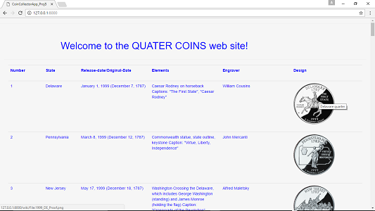
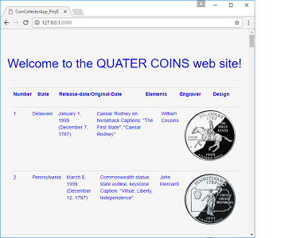

# "coinCollectorProject5_valle"

* This app uses beautifulSoup4 for scrapping a table of quarter coins from
	https://en.wikipedia.org/wiki/50_State_Quarters
*	This information is then saved to a csv file which then is sent to the db where
*	Django pulls the data to be displayed as a table on a local host IP address (127.0.0.1:8000) website.
--------------------------------------------------------------------------------
# 	!Create a folder with anyName and inside that folder clone or fork the following,
*  ---> https://github.com/BorisVV/coinCollectorProject5_valle

* The following needs to be created outside the directory coinCollectorApp/ (inside your anyName folder)
	 	pip freeze > requirements.txt

* create a virtualenv in your machine
*	 	$ virtualenv nameOFEnviromentHere
			(example --> $ virtualenv venv)

* Create a .gitignore file and include the virtualenv in it, and any other file that you don't want in github.com
--------------------------------------------------------------------------------
# $ PIP INSTALL
* 	django
* 	requests
* 	beautifulsoup4
* 	Jinja2
* 	psycopg2
* 	folium
* 	pandas

* !Pillow is not required for this app but can be install with pip if needed.

--------------------------------------------------------------------------------
*	After installing the required modules, apps and dependencies

# Command lines and to RUN the APP (first time follow this instructions below).
# First
* from the directory coinCollectorApp/ run the following commands.
	 	$ python coinSite/manage.py makemigrations
			(no spaces in makemigrations)
	 	$ python coinSite/manage.py migrate

* If you run into trouble, you might need to create a super user first.
* To create a superuser, NOTE - spaces in createsuperuser,
* from the directory coinCollectorApp/
	 $ python coinSite/manage.py createsuperuser
	 	Enter username (or leave default)
	  	Email (optional)
	 	Enter password
		Re-enter password
* (write down the above info as you will need it for Django admin access)

# Second
* from the dirictory coinCollectorApp/ run the following commands.
* 		$ run_app_manager.py  --> to load the data to db.sqlite3
 		$ python coinSite/manage.py runserver --> to lunch the local host web app

--------------------------------------------------------------------------------
#

